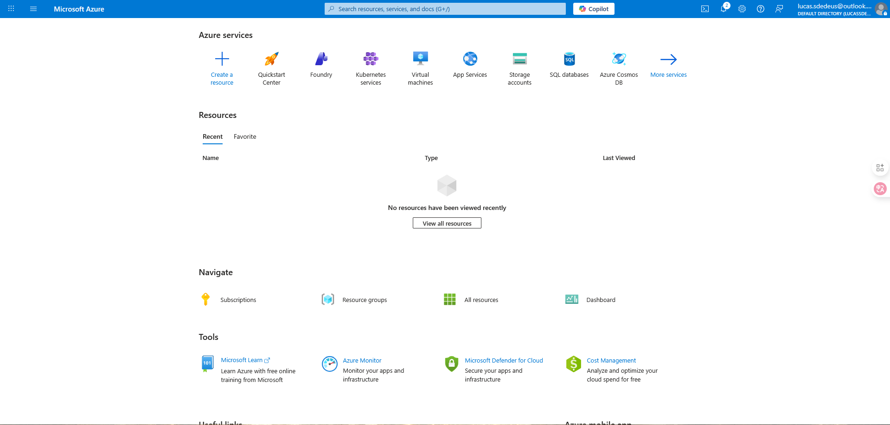
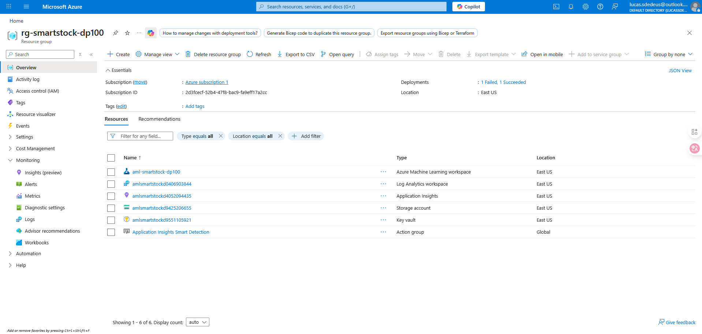
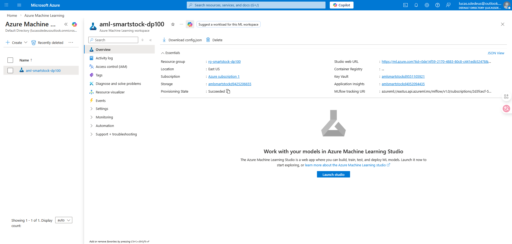
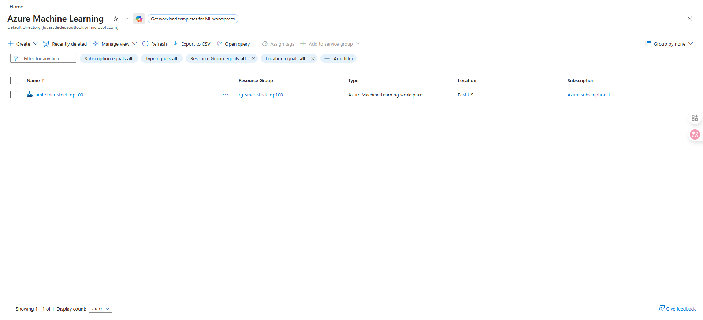
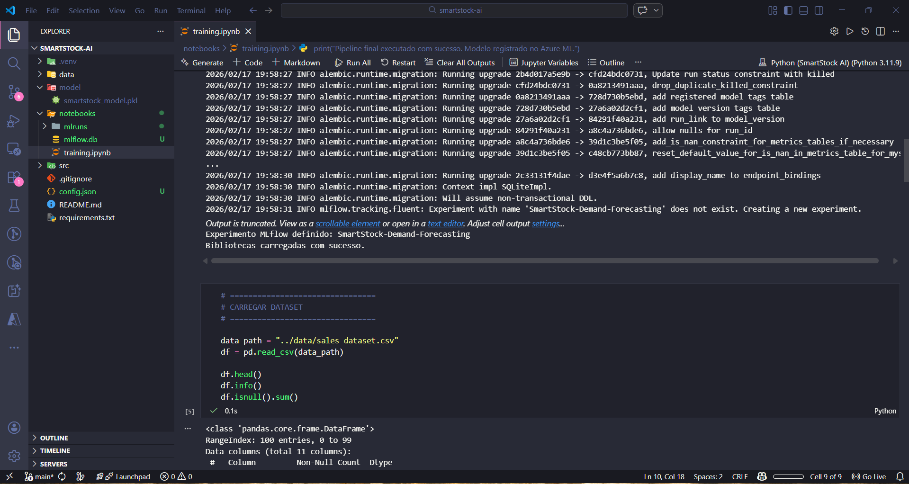
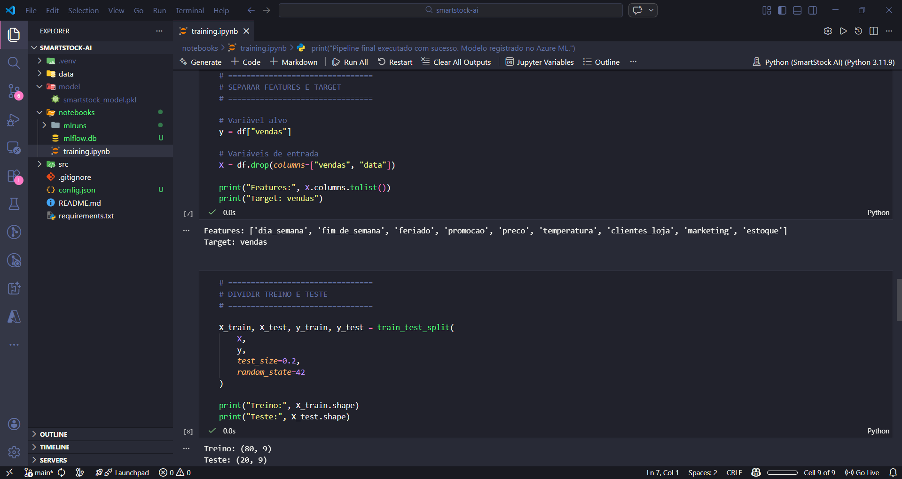
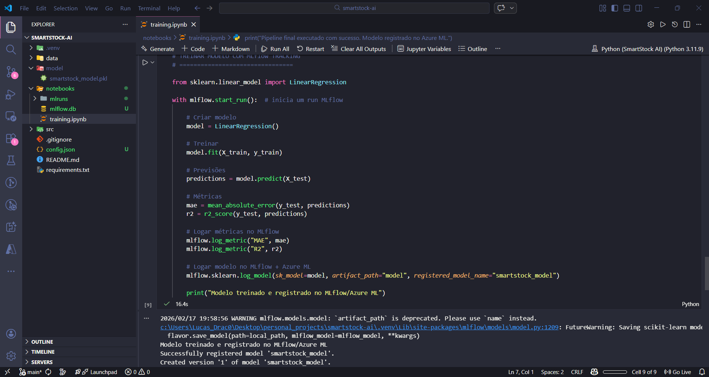

# SmartStock AI - Previsão de Vendas / Sales Forecasting

## Descrição do Projeto (versão pt-BR)
Este projeto tem como objetivo construir um modelo de regressão preditiva para prever as vendas de produtos em uma loja, com foco em otimizar estoque, evitar desperdício e melhorar o rendimento financeiro.  

O projeto foi desenvolvido utilizando **Python**, **Scikit-learn**, **MLflow** e **Azure Machine Learning**, permitindo registrar, monitorar e versionar o modelo em ambiente cloud, seguindo boas práticas de MLOps.

---

## Objetivos

- Treinar um modelo de regressão para prever vendas com base em variáveis como temperatura, promoção, estoque e clientes.
- Registrar métricas e modelos utilizando MLflow integrado ao Azure ML.
- Criar um pipeline reproduzível para treino, teste e previsão.
- Demonstrar fluxo profissional de MLOps para portfólio.

---

## Estrutura do Projeto
```bash
smartstock-ai/
├── data/ # Dataset CSV
│   └── sales_dataset.csv
├── notebooks/
│   └── training.ipynb # Notebook principal
├── model/ # Modelos registrados (MLflow)
├── docs/
│   └── images/ # Prints para README
└── config.json # Configuração do Azure ML Workspace
```
---

## Passo a Passo

1. **Conectar ao Azure ML**
   - Baixar `config.json` do seu Workspace
   - Executar a célula 1 no notebook para conectar MLflow ao Azure ML

2. **Carregar e explorar os dados**
   - Dataset: `sales_dataset.csv`
   - Exploração básica: `df.head()`, `df.info()`, `df.isnull().sum()`

3. **Treinar o modelo**
   - Dividir treino/teste
   - Treinar Linear Regression
   - Avaliar métricas MAE e R²
   - Logar métricas e modelo via MLflow

4. **Testar previsões**
   - Usar um novo dado
   - Conferir previsão de vendas

5. **Registrar modelo**
   - MLflow registra o modelo no Azure ML Workspace
   - Modelo pronto para deploy futuro

---

## Prints do Projeto

### Portal Azure


### Resource Group Criado


### Workspace Criado


### Azure ML Studio


### Notebook Executado




---

## Como reproduzir

1. Criar conta gratuita no [Azure](https://azure.microsoft.com/free)
2. Criar Workspace (passo a passo acima)
3. Baixar `config.json` e colocar na raiz do projeto
4. Instalar dependências:

```bash
pip install -r requirements.txt
# ou
pip install azureml-core mlflow scikit-learn pandas matplotlib
```
---

## Racional do Projeto

- Usar MLflow + Azure ML mostra pipeline profissional e reprodutível
- Métricas registradas no cloud permitem monitoramento histórico
- Foco no portfólio, não apenas no resultado final
- Projeto adaptável para várias lojas e produtos, mostrando potencial escalabilidade

---

## Project Description (US version)
This project aims to build a predictive regression model to forecast product sales in a store, focusing on optimizing inventory, avoiding waste, and improving financial performance.  

The project was developed using **Python**, **Scikit-learn**, **MLflow**, and **Azure Machine Learning**, enabling model tracking, monitoring, and versioning in a cloud environment while following MLOps best practices.

---

## Objectives

- Train a regression model to forecast sales based on variables like temperature, promotion, inventory, and customer flow.
- Log metrics and models using MLflow integrated with Azure ML.
- Build a reproducible pipeline for training, testing, and prediction.
- Showcase a professional MLOps workflow for portfolio purposes.

---

## Project Structure
```bash
smartstock-ai/
├── data/ # CSV Dataset
│   └── sales_dataset.csv
├── notebooks/
│   └── training.ipynb # Main notebook
├── model/ # Registered models (MLflow)
├── docs/
│   └── images/ # Screenshots for README
└── config.json # Azure ML Workspace configuration
```
---

## Step by Step

1. **Connect to Azure ML**
   - Download `config.json` from your Workspace
   - Run cell 1 in the notebook to connect MLflow to Azure ML

2. **Load and explore data**
   - Dataset: `sales_dataset.csv`
   - Basic exploration: `df.head()`, `df.info()`, `df.isnull().sum()`

3. **Train the model**
   - Split train/test datasets
   - Train Linear Regression
   - Evaluate metrics MAE and R²
   - Log metrics and model via MLflow

4. **Test predictions**
   - Use new data
   - Check sales forecast

5. **Register the model**
   - MLflow registers the model in the Azure ML Workspace
   - Model ready for future deployment

---

## Project Screenshots

### Azure Portal


### Created Resource Group


### Workspace Created


### Azure ML Studio


### Notebook Executed


---

## How to Reproduce

1. Create a free account on [Azure](https://azure.microsoft.com/free)
2. Create a Workspace (follow the steps above)
3. Download `config.json` and place it in the project root
4. Install dependencies:

```bash
pip install -r requirements.txt
# or
pip install azureml-core mlflow scikit-learn pandas matplotlib
```
---

## Project Rationale

- Using MLflow + Azure ML demonstrates a professional and reproducible pipeline
- Metrics logged in the cloud allow historical monitoring
- Focus on portfolio showcase, not just final results
- Project adaptable to multiple stores and products, showing scalability potential

---

## Prints do Projeto / 

### Portal Azure


### Resource Group Criado


### Workspace Criado


### Azure ML Studio


### Notebook Executado
